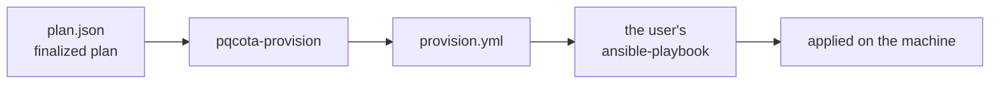
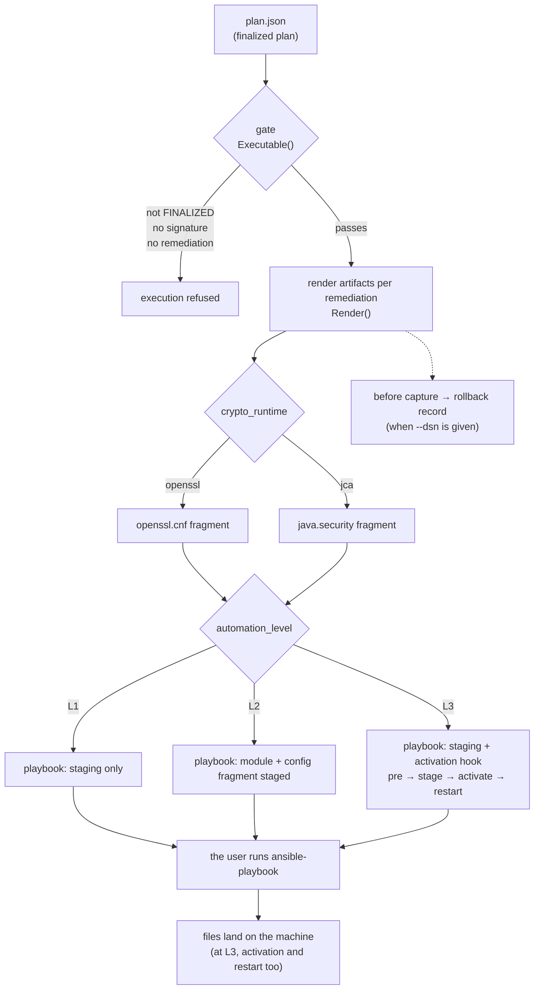

[English](README.md) · 한국어

# pqcota-provisioning: 이관 산출물 생성(3단계)

**확정된 계획**(`FinalizedPlan`)을 입력으로 받아 PQC 이관 산출물을 생성합니다. 설정 조각, Ansible 플레이북(**어디까지 할지는 사용자가 고릅니다.** L1은 모듈을 스테이징하고, L2는 설정을 더하고, L3은 활성화와 재시작까지 합니다. **적용과 되돌림 모두 생성합니다**), 그리고 되돌릴 근거(변경 전 기록, 되돌림 기록)입니다.

무엇을 바꾸고 어떻게 되돌릴지는 **생성기가 결정적으로 정합니다.** 생성된 플레이북은 사용자 자신의 Ansible로 실행합니다. 계획은 **사용자가 씁니다** → [샘플과 필드](examples/provisioning/plans/README.ko.md).

> **범위**: 런타임은 **openssl**과 **jca** 둘입니다. 그 밖의 것은 산출물을 만들지 않고 그렇다고 적습니다(`# (unknown runtime)`). 출력은 POSIX 방식의 파일 배치(스테이징과 Ansible `copy`/`absent`)를 전제하므로 **노드는 Linux입니다.** CNG 전환물 생성은 [로드맵](https://github.com/randyinthedev-hash/pqcota/blob/main/RELEASE_NOTES.md#roadmap--upcoming-releases-planned)(영문)에 있습니다.

[pqcota](https://github.com/randyinthedev-hash/pqcota)를 이루는 리포지터리 다섯 개 가운데 하나입니다. 나머지는 `pqcota-common`, `pqcota-inventory`, `pqcota-discovery`, 그리고 통합 리포지터리 `pqcota`(데모, 예제, 릴리스 번들, 기여 안내)입니다.

## 한눈에 보기



**도구는 플레이북과 설정을 생성하고 되돌릴 근거를 남깁니다.** 실제 적용은 사용자가 자신의 Ansible로 실행합니다.

<details>
<summary><b>전체 절차: 게이트, 런타임 분기, 수준, 되돌림 (펼치기)</b></summary>



</details>

## 구성 요소

| 요소 | 무엇인가 |
|---|---|
| **입력**: 확정된 계획 | 어느 노드의 무엇을 어떤 provider로 바꿀지 적은 JSON입니다. 사용자가 씁니다 → [샘플과 필드](examples/provisioning/plans/README.ko.md) |
| **생성기**: `pqcota-provision` | 계획을 읽어 설정 조각과 Ansible 플레이북을 만듭니다 |
| **출력**: 플레이북 | 적용용 하나, 되돌림용 하나입니다. 표준 Ansible이므로 자신의 도구로 실행합니다 |
| **근거**: 되돌림 기록 | `--dsn`을 지정하면 조치 *전*의 상태를 추가 전용으로 기록합니다 → [`pqcota-records`](cmd/README.ko.md) |

## 빠르게 해 보기

```bash
# ⓪ approve — raise the judged plan (IN_REVIEW) to FINALIZED while signing it, and register the key it will be checked with.
#    With no key to check, the generator refuses: an approval is where responsibility sits,
#    and one nobody can verify leaves that place empty.
eval "$(pqcota-keygen | grep '^PQCOTA_')"          # SIGN_KEY (private) · VERIFY_KEY (public)
PQCOTA_APPROVAL_KEY="$PQCOTA_SIGN_KEY" \
  pqcota-approve --approver reviewer-1 plan.json > plan.signed.json
export PQCOTA_APPROVAL_KEYS="reviewer-1=$PQCOTA_VERIFY_KEY"

# ① generate — build a playbook from the approved plan
pqcota-provision --level l2 plan.signed.json > provision.yml

# ② apply — reuse the same targets.ini you used for discovery
ansible-playbook -i targets.ini provision.yml

# ③ undo — generate the reverse playbook from the same plan and run it
pqcota-provision --level l2 --rollback plan.signed.json > provision-rollback.yml
ansible-playbook -i targets.ini provision-rollback.yml
```

모든 옵션과 provider 모듈을 둘 곳은 [cmd/README](cmd/README.ko.md)에 있습니다. 무엇이든 실행하기 전에 **계획이 게이트를 통과해야 합니다.** `status`가 `PLAN_STATUS_FINALIZED`가 아니거나, 승인 서명이 없거나, 조치가 하나도 없으면 아무것도 생성하지 않습니다. **판정이 끝난 계획은 `IN_REVIEW`로 도착하고 `pqcota-approve`가 이를 `FINALIZED`로 올립니다.** 그래서 승인을 건너뛴 계획은 상태에서 먼저 걸립니다.

## 출력을 정하는 두 축

**`kind`는 「무엇을」을 정하고 `automationLevel`은 「어디까지」를 정합니다.** 둘의 조합이 출력을 결정합니다.

| `kind` | 그 조치가 스테이징하는 것(L1) | (L2) | (L3) |
|---|---|---|---|
| `CONFIG_ONLY` | 없음. **L2부터 시작합니다** | 설정 조각 | 설정 조각 + **활성화와 재시작** |
| `PROVIDER_INJECT` | provider 모듈 | provider 모듈 + 설정 조각 | 모듈 + 설정 조각 + **활성화와 재시작** |
| `FORK_REPLACE`·`PROXY_FRONT`·`REBUILD`·`JDK_UPGRADE`·`APP_RECONFIG`·`DECOMMISSION` | 없음. **어느 수준에서도** | 〃 | 〃 |

첫 행이 L1에서 비어 있는 것과 마지막 행이 비어 있는 것은 **뜻이 다릅니다.** 첫 행은 「아직」이고, 마지막 행은 「영원히 아님」입니다. 그래서 마지막 행만 **비어 있는 까닭을 설명하는 주석을 플레이북에 남깁니다.**

활성화와 재시작 명령은 계획의 `activation` 훅에서 가져옵니다. 훅이 없으면 L3에서도 그 단계를 생성하지 않습니다.

```
    # remediation a2 (REMEDIATION_KIND_FORK_REPLACE): cannot be deployed via config — manual step
```

## 동작하지 않을 때: 증상과 원인

| 증상 | 원인 |
|---|---|
| `plan not finalized — provisioning refused` | `status`가 FINALIZED가 아니거나 `approvalSignatures`가 비어 있습니다. 대개 **`pqcota-approve`를 건너뛴 것**입니다. 판정이 끝난 계획은 `IN_REVIEW`로 도착하고 승인이 이를 올립니다 |
| `refusing to approve: … inconsistent with its own status` | `IN_REVIEW`인데 승인이나 `finalized_at`이 있거나, `FINALIZED`인데 둘 중 하나가 없습니다. 상태를 손으로 고쳐 넣은 것입니다 |
| 플레이북에 설정 조각이 없음 | `--level l1`입니다. 설정은 L2부터입니다 |
| 조각에 `Groups`/`namedGroups`가 주석으로만 있음 | `targetAlgorithm`이 KEM이 아니거나 인식되지 않았습니다 |
| 플레이북에 조치가 주석으로만 있음 | 그 `kind`는 설정으로 배포할 수 없습니다(포크 교체, 재빌드 등) |
| provider 클래스 이름이 `<…confirm>`으로 나옴 | `providerChoice`가 BC 계열이 아닙니다. 알맞은 클래스 이름으로 바꾸세요 |
| `Could not find or access '…so'`(실행 시) | 모듈 원본을 찾지 못했습니다. `files/`에 두거나 `-e pqcota_module_src_<name>=`로 넘기세요 |
| provider가 여럿인데 모두에 같은 파일이 스테이징됨 | 전역 `pqcota_module_src`를 썼습니다. provider별 변수나 `files/` 규칙을 쓰세요 |
| 적용했는데 협상이 여전히 고전임 | 조각을 **스테이징만 하고** 참조하거나 재시작하지 않았습니다(L3). JCA라면 provider가 우선순위에서 뒤에 있습니다 |

## 이 리포지터리의 구성

| 경로 | 내용 |
|---|---|
| `pkg/provisioning/` | 라이브러리입니다. 계획 게이트, 분류 체계에서 설정으로 가는 생성기(OpenSSL과 JCA), 플레이북 생성기, `CaptureState`, 기록 저장소가 있습니다 |
| `cmd/` | 명령입니다. `pqcota-provision`, `pqcota-approve`, `pqcota-records` |
| `examples/` | 실행할 수 있는 예제입니다. `examples/provisioning/plans/` 아래의 케이스별 계획, 생성된 플레이북, 되돌림이 있습니다 |

## 의존하는 것

`pqcota-common`과 `pqcota-inventory`입니다. discovery에는 의존하지 않습니다.

## 빌드와 테스트

```bash
make            # every check of this repository
go test ./...   # unit tests only
```

`go.mod`는 `replace` 지시문으로 형제 리포지터리를 `../`에서 읽으므로(`../pqcota-common` 등) 리포지터리를 나란히 클론하세요. `replace` 줄은 그대로 둡니다. 리포지터리 사이의 로컬 연결이고, `require` 줄은 릴리스 태그(현재 `v0.10.4`)를 가리키며 이 작업 공간 밖의 소비자가 받는 것은 이쪽입니다. [빌드 안내](https://github.com/randyinthedev-hash/pqcota/blob/main/docs/build.ko.md#소스-받기)를 보세요.

## 함께 보기

- 실행할 수 있는 최소 예제: [examples/provisioning](examples/provisioning/README.ko.md)
- 처음부터 끝까지의 데모: [demo](https://github.com/randyinthedev-hash/pqcota/blob/main/demo/README.ko.md)

## 기여 · 보안 · 라이선스

기여와 보안 신고 방법은 [pqcota 리포지터리](https://github.com/randyinthedev-hash/pqcota)(영문)에 있습니다. 라이선스는 [Apache-2.0](https://github.com/randyinthedev-hash/pqcota/blob/main/LICENSE)(영문)입니다.
