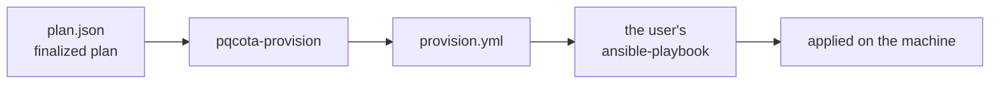
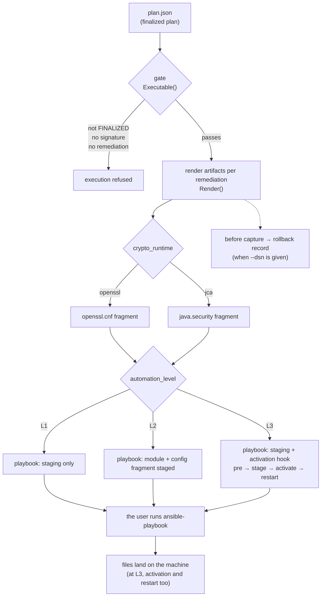

English · [한국어](README.ko.md)

# pqcota-provisioning — generating migration artifacts (stage 3)

Takes a **finalized plan** (`FinalizedPlan`) as input and generates PQC migration artifacts — config fragments, Ansible playbooks (**you choose how far they go** — L1 stages the module, L2 adds the config, L3 activates and restarts; **both apply and rollback**), and the basis for undoing (before capture, rollback records).

What to change and how to undo it is **decided deterministically by the generator**; running the resulting playbook is done by the user's own Ansible. The plan is **written by the user** → [samples and fields](examples/provisioning/plans/README.md).

> **Scope** — two runtimes: **openssl** and **jca**. Anything else produces no artifact and says so (`# (unknown runtime)`). The output assumes POSIX file placement (staging plus Ansible `copy`/`absent`), so **the nodes are Linux**. CNG provisioning is on the [roadmap](https://github.com/randyinthedev-hash/pqcota/blob/main/RELEASE_NOTES.md#roadmap--upcoming-releases-planned).

It is one of five repositories that make up [pqcota](https://github.com/randyinthedev-hash/pqcota): `pqcota-common`, `pqcota-inventory`, `pqcota-discovery`, `pqcota-provisioning`, and the integration repository `pqcota` (demo, examples, release bundles, contributing guide).

## At a glance



**The tool generates the playbook and the config, and leaves behind the basis for undoing.** The actual application is run by the user with their own Ansible.

<details>
<summary><b>The full procedure — gate, runtime branch, level, rollback (expand)</b></summary>



</details>

## What it consists of

| Piece | What it is |
|---|---|
| **Input** — the finalized plan | JSON stating which node's what is to be changed to which provider. The user writes it → [samples and fields](examples/provisioning/plans/README.md) |
| **Generator** — `pqcota-provision` | reads the plan and produces config fragments and Ansible playbooks |
| **Output** — playbooks | one to apply, one to undo. Standard Ansible, so you run them with your own tooling |
| **Basis** — rollback records | given `--dsn`, the state *before* the remediation is recorded append-only → [`pqcota-records`](cmd/README.md) |

## Try it quickly

```bash
# ⓪ approve — raise the judged plan (IN_REVIEW) to FINALIZED while signing it, and register the key it will be checked with.
#    With no key to check, the generator refuses: an approval is where responsibility sits,
#    and one nobody can verify leaves that place empty.
eval "$(pqcota-keygen | grep '^PQCOTA_')"          # SIGN_KEY (private) · VERIFY_KEY (public)
PQCOTA_APPROVAL_KEY="$PQCOTA_SIGN_KEY" \
  pqcota-approve --approver reviewer-1 plan.json > plan.signed.json
export PQCOTA_APPROVAL_KEYS="reviewer-1=$PQCOTA_VERIFY_KEY"

# ① generate — build a playbook from the approved plan
pqcota-provision --level l2 plan.signed.json > provision.yml

# ② apply — reuse the same targets.ini you used for discovery
ansible-playbook -i targets.ini provision.yml

# ③ undo — generate the reverse playbook from the same plan and run it
pqcota-provision --level l2 --rollback plan.signed.json > provision-rollback.yml
ansible-playbook -i targets.ini provision-rollback.yml
```

All options, and where provider modules go → [cmd/README](cmd/README.md). Before anything runs, **the plan must pass the gate** — if `status` is not `PLAN_STATUS_FINALIZED`, or there are no approval signatures, or there is not a single remediation, nothing is generated. **A judged plan arrives as `IN_REVIEW` and `pqcota-approve` raises it to `FINALIZED`** — so a plan that skipped approval is caught by its status first.

## The two axes that decide the output

**`kind` decides "what", `automationLevel` decides "how far".** Their combination determines the output.

| `kind` | What that remediation stages (L1) | (L2) | (L3) |
|---|---|---|---|
| `CONFIG_ONLY` | nothing — **it starts at L2** | config fragment | config fragment + **activation and restart** |
| `PROVIDER_INJECT` | provider module | provider module + config fragment | module + config fragment + **activation and restart** |
| `FORK_REPLACE`·`PROXY_FRONT`·`REBUILD`·`JDK_UPGRADE`·`APP_RECONFIG`·`DECOMMISSION` | nothing — **at any level** | 〃 | 〃 |

The first row being empty at L1 and the last row being empty **mean different things.** The first is "not yet"; the last is "never" — which is why only the last row leaves **a comment in the playbook explaining why nothing is there.**

The activation and restart commands come from the plan's `activation` hook. Without the hook, that step is not generated even at L3.

```
    # remediation a2 (REMEDIATION_KIND_FORK_REPLACE): cannot be deployed via config — manual step
```

## When it doesn't work — symptom and cause

| Symptom | Cause |
|---|---|
| `plan not finalized — provisioning refused` | `status` is not FINALIZED, or `approvalSignatures` is empty. Usually **`pqcota-approve` was skipped** — a judged plan arrives as `IN_REVIEW` and approval raises it |
| `refusing to approve: … inconsistent with its own status` | `IN_REVIEW` with an approval or a `finalized_at`, or `FINALIZED` missing either. The status was edited in by hand |
| the playbook has no config fragment | you are on `--level l1`. Config starts at L2 |
| the fragment has `Groups`/`namedGroups` only as a comment | `targetAlgorithm` is not a KEM, or was not recognized |
| the playbook has the remediation only as a comment | that `kind` cannot be deployed via config (fork replacement, rebuild, and so on) |
| the provider class name comes out as `<…confirm>` | `providerChoice` is not in the BC family — replace it with the proper class name |
| `Could not find or access '…so'` (at run time) | the module source was not found — put it in `files/` or pass `-e pqcota_module_src_<name>=` |
| several providers but the same file was staged for all | you used the global `pqcota_module_src` — use per-provider variables or the `files/` convention |
| applied, but the negotiation is still classical | the fragment was **only staged** and never referenced or restarted (L3), or, on JCA, the provider sits late in the priority order |

## What is here

| Path | What |
|---|---|
| `pkg/provisioning/` | the library: the plan gate, the taxonomy-to-config generators (OpenSSL and JCA), the playbook generator, `CaptureState`, and the record stores |
| `cmd/` | the commands: `pqcota-provision`, `pqcota-approve`, `pqcota-records` |
| `examples/` | runnable examples: one plan per case under `examples/provisioning/plans/`, the generated playbooks, and rollback |

## Depends on

`pqcota-common` and `pqcota-inventory`. It does not depend on discovery.

## Build and test

```bash
make            # every check of this repository
go test ./...   # unit tests only
```

`go.mod` reads the sibling repositories from `../` through `replace` directives (`../pqcota-common` and so on), so clone the repositories side by side. The `replace` lines stay: they are the local link between the repositories, while the `require` lines point at the release tag (currently `v0.10.4`), which is what a consumer outside this workspace receives. See the [build guide](https://github.com/randyinthedev-hash/pqcota/blob/main/docs/build.md#get-the-source).

## See also

- Minimal runnable examples: [examples/provisioning](examples/provisioning)
- End-to-end demo: [demo](https://github.com/randyinthedev-hash/pqcota/tree/main/demo)

## Contributing · security · license

Contributing and security reporting are described in the [pqcota repository](https://github.com/randyinthedev-hash/pqcota).

Copyright 2026 Great Honor <randyinthedev@gmail.com>. Licensed under the [Apache License 2.0](https://github.com/randyinthedev-hash/pqcota-provisioning/blob/main/LICENSE).
